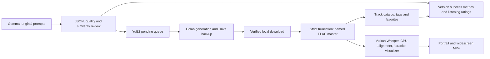

# Wolf Music Studio

A complete workflow for making original wolf-girl synth-metal: Gemma writes and reviews prompts, YuE2 generates music on Colab, downloads are verified and trimmed, a searchable track library stores prompts/tags/favorites, and a local visualizer creates karaoke MP4s.

This repository brings the previously separate YuE2, visualizer and Gemma projects into one portable checkout. It includes the actual three reference prompts—**Frizzed and Fractured V2**, **Bone and Iron V3**, and **Pelt and Polish V3**—plus the newer songwriting harness and historical song configs. It contains source and examples, not generated recordings, model weights, account credentials or active queues.



Gemma and the visualizer take turns using one local hardware lease. A songwriting campaign keeps Gemma loaded across drafts and retries, reusing its system/example prefix. Colab generation and local downloads can continue independently.

## Install

Linux with Python **3.12** is the tested environment. On Ubuntu/Debian, install the system tools first:

```bash
sudo apt-get update
sudo apt-get install -y python3-venv python3-dev build-essential cmake git curl jq pkg-config libssl-dev \
  ffmpeg mpv rclone libsndfile1 fonts-dejavu-core libegl1 libgl1 libgl1-mesa-dri \
  libvulkan-dev vulkan-tools \
  glslc glslang-dev glslang-tools spirv-tools spirv-headers mesa-vulkan-drivers mesa-va-drivers
```

Then install the whole local stack, build the pinned Vulkan engines and download models:

```bash
git clone https://github.com/amazingfly/wolf-music-studio.git
cd wolf-music-studio
./studio setup --profile all --engines --models
./studio doctor
```

For only the queue, library, trimmer and prompt-review tools:

```bash
./studio setup --profile controller
```

`--tags` adds optional Essentia tagging; `--dev` adds pytest. Models and Python environments take substantial space; allow roughly 25–40 GB before storing generated audio/video. Downloads happen only when requested by `--models` or during first model use. [Installation guide](docs/INSTALL.md) explains account authentication, requirements and CPU/GPU choices.

Edit the ignored `local/settings.json` created by setup. Set `drive_base` to your own rclone remote and folder; no original account IDs are required. Configure Google Drive with `rclone config`, and authenticate Colab with the installed CLI and your OAuth client:

```bash
.venv/bin/colab --client-oauth-config /path/to/client.json sessions
```

After authentication and model setup:

```bash
./studio services install
./studio services start
./studio logs songwriter
```

The installer does not start services automatically. Services use the `wolfstudio-` prefix and are rendered with the actual checkout path; old `yue2-` services are not replaced. See [migration](docs/MIGRATION.md) before switching an existing installation.

## Everyday use

```bash
./studio library                              # interactive, name search by default
./studio make-config -name powerwolf -iString 'gemini-' -time 5h
./studio trim /path/to/downloaded/run          # recursively process audio.flac files
./studio visualize --status
./studio songwriter --status
./studio compare                              # refresh success/listening comparison
./studio logs queue
```

Accepted songwriter configs are published atomically to `yue2/queue/pending`. The first accepted song is submitted immediately; later configs normally contain ten songs. To submit your own config, validate it with the queue preparation command first or use `make-config`.

Each input song gets **one music generation** using its configured seed. To opt into three seeds per song for a new run:

```bash
./studio start-run --config songs.json --seedSweep 3
# Add --prepare-only to inspect requests without allocating Colab.
```

Three means three total generations, including the original seed. Extra seeds are deterministic and get separate track directories. Resuming a saved run preserves all its requests, including older WolfcoreV7 seed variants. Songwriter story variations are different lyric drafts, not audio seed sweeps.

The library has nonblocking mpv playback, seek controls, clipboard export of prompt JSON and space-separated hashtags, advanced search, and favorite categories that export clean example configs. Its interface and the comparison page use black text on white.

The comparison page, `yue2/songwriter/comparison/comparison.html`, tracks raw passes/failures, ending fixes, isolated lyric repairs, full rewrites and final acceptance independently. It links to available audio/video and lets you score pace, vocals, story and overall quality. Browser ratings can be exported and imported into campaign records. Mechanical acceptance is not a musical-quality score.

## Documentation

- [Installation and configuration](docs/INSTALL.md)
- [Commands, queue operation, logs and backups](docs/OPERATIONS.md)
- [Migrating the current three-project installation](docs/MIGRATION.md)
- [Architecture and source map](docs/ARCHITECTURE.md)
- [Development, testing and publication](docs/DEVELOPMENT.md)
- [Detailed track-library controls](yue2/README_LOCAL_RUN.md)
- [Trimming algorithm and review viewer](yue2/README_autoTrim.md)
- [Songwriter V2 design and accounting](yue2/README_songwriter_v2.md)
- [Visualizer/karaoke internals](visualizer/README.md)
- [Original YuE2 inference documentation](yue2/README.md)

The project uses Apache-2.0 for its source; retained upstream notices and separate model/dependency licenses are listed in [NOTICE](NOTICE) and the YuE2 license files. [sources.json](sources.json) records upstream revisions. Model downloads and generated artifacts are deliberately outside Git.
